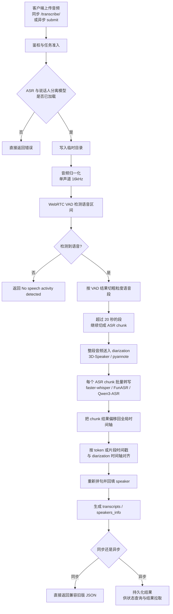

# MSR Architecture

## Summary

MSR is a single-process FastAPI service designed for offline multi-speaker transcription. The project favors explicit runtime state and minimal moving parts over automation-heavy orchestration.

## Runtime model

MSR keeps exactly two runtime model slots:

- one active ASR backend
- one active diarization backend

Models are registered statically in `config/models.toml`, but they are not loaded during process startup. All loading and unloading happens through management APIs.

The service is exposed upstream as both a compatibility synchronous API and a task-oriented asynchronous API. Internally it maintains:

- bounded parallel execution slots
- a bounded waiting queue
- recent task summaries persisted to local files under `runtime.data_dir`

## Main request flow

1. Client uploads audio to either `POST /transcribe/` or `POST /api/v1/transcriptions/submit`
2. Service validates API key
3. Service verifies that ASR and diarization backends are loaded
4. Request is admitted into the runtime scheduler or rejected with `queue_full`
5. Audio is staged to local temp storage
6. Audio is normalized to mono 16 kHz
7. WebRTC VAD produces coarse speech ranges
8. Diarization backend analyzes the full audio
9. Long VAD ranges are split into bounded ASR chunks to reduce peak GPU memory
10. Each bounded ASR chunk is sent through the active ASR backend, preferably through the shared `transcribe_many(...)` batch path
11. ASR segments are matched to the diarization timeline by overlap
12. Response is shaped to preserve the old demo contract or persisted for async result retrieval

### Flow diagram

### VAD role

- 当前项目里确实在用 `WebRTC VAD`
- VAD 的职责不是替代 diarization，而是先找出“哪里有语音”
- diarization 仍然对整段音频做“谁在什么时候说话”
- VAD 结果主要用于：
  - 拒绝纯静音或无语音输入
  - 把整段音频切成更适合 ASR 的粗粒度语音段
  - 把超长语音段继续拆成 `<= 20s` 的 ASR chunk，降低显存峰值
- 目前 `faster-whisper` 后端内部显式设置了 `vad_filter=False`，说明主链采用的是服务层统一 VAD，而不是依赖 ASR backend 自己再做一套切分

## Module boundaries

- `core/`: pure app wiring, config, security, errors
- `services/`: orchestration, runtime scheduling, resource monitoring and task state
- `backends/`: third-party model adapters only, including `FunASR`, `faster-whisper`, and experimental `Qwen3-ASR`
- `api/`: HTTP contracts only
- `web/`: static management console only, used by admins and as API usage sample

## Offline contract

MSR enforces offline execution by policy:

- model config must point to local directories
- no runtime model download logic is allowed
- no token-based fetch is allowed in service code
- startup sets strict offline environment variables

## Extension policy

v1 only treats ASR as a formal pluggable boundary. Diarization remains internally switchable, but we intentionally avoid a larger plugin system until the current runtime proves stable.

The current ASR matrix is:

- `faster-whisper`: current default offline chain, paired with `3D-Speaker + WebRTC VAD`
- `FunASR`: retained as an alternate backend, but no longer treated as the default service path
- `Qwen3-ASR`: experimental alternate backend, loaded through local in-process `vLLM` and requiring `Qwen3-ForcedAligner`

`Qwen3-ASR` reuses the same public response contract as other backends. Its `ForcedAligner` output is converted into existing `TimedToken` records so the downstream speaker token-level reassignment logic stays unchanged.

Future speaker identity work is intentionally staged behind the current pipeline. The next planned capability is a local speaker registry that stores speaker embeddings or other voice features so identities can be reused across audio files, for example mapping diarization speaker `A` in audio 1 to `Alice` and resolving the same voice in audio 2 back to `Alice`. The current design draft lives in `docs/speaker-registry-design.md`.
