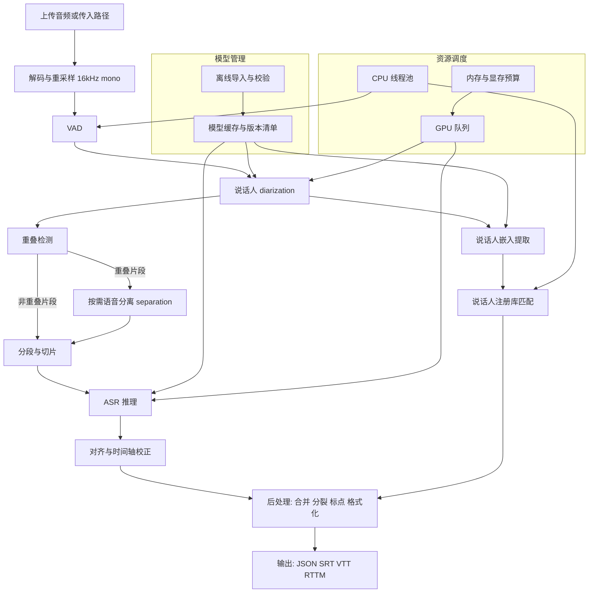
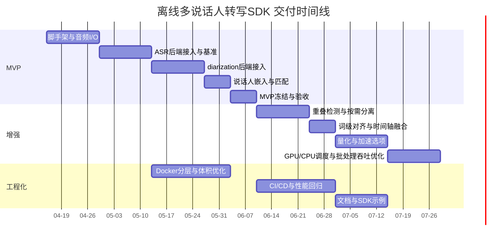

# 离线多说话人转写与说话人分离及匹配的主流开源技术方案研究报告

## 执行摘要

本报告面向“离线环境下上传音频文件，输出转录文本、说话人分离结果与说话人匹配结果，并可封装为 Docker 镜像 SDK”的目标，梳理了截至 2026 年 4 月仍被广泛采用、生态成熟的开源技术栈，并给出可落地的组合方案、离线 SDK 架构、工程化路线图与评估方法。

当前最主流的开源落地路径以“模块化管线”为核心：ASR 侧以 Whisper 系列及其高性能推理实现作为通用底座，Whisper 由 entity["company","OpenAI","ai research lab"] 开源发布，论文与官方介绍强调其在 68 万小时多语言弱监督数据上训练，具备多语言转写与翻译能力。citeturn6search0turn6search12turn6search4 在工程侧，faster-whisper 将 Whisper 迁移到 CTranslate2 推理引擎，给出在同等准确率下更快、可量化的推理实现与公开基准。citeturn10view3turn5search15

在“谁在何时说话”的说话人分离层面，pyannote.audio 仍是开源生态里最具代表性的离线 diarization 工具之一，并公开了多数据集 DER 与推理实时因子示例，例如其 speaker-diarization 管线在 V100 GPU 加速神经网络部分、CPU 完成聚类部分时实时因子约 2.5%。citeturn13view0 同时，pyannote 的新版本分发中出现了对部署友好的变化，如 3.1 管线移除 onnxruntime 依赖、转而纯 PyTorch 运行，降低了部署复杂度。citeturn11view0

说话人匹配与识别层面，实践中常用“说话人嵌入向量 + 相似度阈值/PLDA”的注册与比对流程。SpeechBrain 在开源工具链中提供了成熟的 ECAPA-TDNN 说话人验证模型与对应基准结果，并在论文中总结了其在 VoxCeleb 上的 EER 与在 AMI 上的 diarization 结果。citeturn12search22turn1search8turn7search14 此外，entity["company","NVIDIA","gpu computing company"] 的 NeMo 生态同样覆盖 ASR 与 diarization，文档明确其 diarization 支持端到端 Sortformer 与级联式聚类管线（MarbleNet VAD + TitaNet embeddings + spectral clustering），并给出了离线 diarization 与 ASR 联合推理脚本示例。citeturn11view2turn11view1turn9view3

综合准确率、实现复杂度与离线可部署性，本报告推荐的“默认优先落地栈”是：faster-whisper 负责 ASR，pyannote 负责离线 diarization，SpeechBrain 负责说话人嵌入与匹配，重叠语音区域按需引入分离模型（如 SepFormer 或 Conv-TasNet）以提升重叠段的可转写性。WhisperX 可作为快速集成范例，它将 faster-whisper、对齐与 pyannote diarization 打包成高层工具，并公开了批量推理的速度与显存门槛提示。citeturn10view2turn7search28

关键风险集中在三类：其一，模型与代码许可分离，部分项目的模型分发需要先接受条款或获取令牌，必须在 SDK 的离线交付策略中显式处理。citeturn10view1turn13view0turn11view0 其二，GPU 推理依赖的 CUDA 与 cuDNN 版本兼容性可能制约“一套镜像覆盖 CUDA 11.x 到更高版本”，例如 faster-whisper 文档指出新版本 ctranslate2 侧偏向 CUDA 12 与 cuDNN 9，并建议 CUDA 11 环境通过降级 ctranslate2 规避。citeturn15view1turn5search15 其三，离线多说话人场景中 diarization 常成为整条链路的主要耗时项，必须通过批处理、缓存与 GPU/CPU 协同调度做性能工程。citeturn13view0turn12search4

## 目标与问题拆解

本项目目标可以拆成三条必须同时满足的能力链，并在离线环境中形成可复用 SDK。

任务链由三部分组成：

* 多说话人语音识别（ASR）：从音频得到文本与时间戳，理想输出包括段级时间戳，最好能到词级时间戳，便于与说话人边界对齐。Whisper 属于端到端编码器解码器架构的多任务模型，并提供多个尺寸与 turbo 变体以平衡速度与精度。citeturn6search0turn6search8turn6search4  
* 说话人分离：此处需区分两个常被混用的概念。  
  * diarization：输出“谁在何时说话”的时间片与匿名说话人标签。pyannote 与 NeMo 都提供了典型的离线 diarization 管线，并支持指定或约束说话人数量。citeturn13view0turn11view2  
  * source separation：在语音重叠区域，将混合语音分解成多路波形，以提升后续 ASR 可读性。Conv-TasNet 与 SepFormer 属于时间域或掩蔽式分离模型的代表，LibriMix 等数据集推动了其可复现评测。citeturn14search0turn14search1turn3search0  
* 说话人匹配与识别：把 diarization 的匿名簇映射到“已知身份库”，或在跨音频、跨会话场景保持同一人的一致 ID。这通常通过提取说话人 embedding，再与注册库做相似度匹配或 PLDA 打分完成。SpeechBrain 提供 ECAPA-TDNN 等嵌入与验证工具链，并公开基准结果。citeturn12search22turn1search8turn7search14

工程约束与隐含假设如下：

* 运行环境：Linux x86_64。  
* 加速：支持 NVIDIA GPU 与纯 CPU。GPU 用于低延迟或准实时，CPU 用于批量离线。  
* CUDA 版本：目标支持 CUDA 11.x 或更高，需在镜像中显式处理依赖版本分叉。faster-whisper 的依赖说明显示 ctranslate2 版本与 CUDA 与 cuDNN 版本存在耦合，CUDA 11 环境可能需要固定到更旧的 ctranslate2 版本。citeturn15view1turn5search15  
* 实时延迟上限：未指定，报告中对实时性只给出估计与影响因素。  
* 交付形态：可打包为 Docker 镜像的 SDK，提供 REST 或 gRPC，亦可提供本地 Python 与 C++ SDK。

对技术链路的核心难点可归纳为三点：

第一，时间轴对齐。diarization 的边界通常来自 VAD 与嵌入聚类，ASR 的边界来自解码与对齐，二者在时间粒度与误差分布上不同，若无词级对齐，最终“谁说了这句话”容易出现错配。WhisperX 的设计动机之一就是补齐 Whisper 原生时间戳较粗的问题，并提供对齐与 diarization 的组合。citeturn10view2

第二，重叠语音处理。传统 diarization 在强重叠场景会显著升高混淆率，部分 diarization 工具通过重叠检测与重分割缓解，但在高重叠会议中，显式引入 speech separation 或 target speaker extraction 常能改善可转写性。Conv-TasNet 与 SepFormer 论文都以重叠说话人分离为核心问题设置。citeturn14search0turn14search1

第三，离线部署与许可。pyannote 的示例与模型卡显示，部分预训练管线在下载模型文件前需要接受条件与使用访问令牌，SDK 需要在“构建期预取”与“运行期离线”之间实现合规的供应链策略。citeturn10view1turn13view0turn11view0

## 主流开源项目与库对比

下表覆盖当前主流的开源项目与常用组件，聚焦其对 ASR、diarization、separation、speaker-id 的覆盖度、离线运行能力、依赖与加速形态，以及许可证。若某项公开信息缺失，将标注“未公开/未找到”。

### 项目能力与部署特性对比表

| 项目 | 功能 | 依赖 | 离线支持 | 加速选项 | 许可 |
|---|---|---|---|---|---|
| Kaldi | 传统 ASR 工具链，含 DNN-HMM 体系（chain 等），并有 x-vector 说话人表示相关配方与模型资源 | C++ 工具链，多依赖系统库，支持 CUDA 编译组件 | 支持 | 训练与部分组件可用 CUDA；工程常配合自研推理服务 | Apache-2.0 citeturn0search12turn17search2 |
| ESPnet | 端到端语音处理工具箱，覆盖 ASR、增强、分离、diarization 等任务，并提供 Model Zoo | 以 PyTorch 为深度学习引擎，配合 Kaldi 风格数据处理 | 支持 | 官方提供 espnet_onnx 支持导出 ONNX 并做量化与优化，面向部署端减少对 PyTorch 依赖 citeturn10view0turn18search1 | Apache-2.0 citeturn18search3turn0search17 |
| OpenAI Whisper | 通用多语言 ASR，支持转写、翻译、语言识别，提供多尺寸模型并在 2024 年加入 turbo 变体 | Python + PyTorch（官方实现）；模型权重开源 | 支持 | 社区出现多种推理后端与量化实现 | MIT citeturn6search4turn6search8turn0search6 |
| faster-whisper | Whisper 的高性能推理实现，基于 CTranslate2，公开 GPU 与 CPU 基准，并支持 8-bit 量化 | CTranslate2 推理引擎，Python 包装；GPU 侧依赖 cuBLAS 与 cuDNN | 支持 | 支持 CPU 与 GPU 的 8-bit 量化；文档给出 CUDA 与 cuDNN 版本兼容提示 citeturn10view3turn15view1turn5search15 | MIT citeturn7search1turn15view0 |
| WhisperX | Whisper 的工程化组合工具，集成 faster-whisper 批量推理、词级对齐与 pyannote diarization，并提示显存门槛与速度特征 | faster-whisper + pyannote.audio + 对齐模型（如 wav2vec2） | 支持 | 批量推理与 GPU 加速；对齐与 diarization 依赖 PyTorch 生态 | BSD-2-Clause citeturn10view2turn7search0turn7search28 |
| whisper.cpp | Whisper 的 C/C++ 端实现，强调无依赖、CPU-only、量化与多后端支持，并给出 GPU 支持与 Docker 场景 | C/C++，使用 ggml；支持多平台 | 支持 | 支持整数/低精度量化；支持 NVIDIA GPU、Vulkan、OpenVINO 等多后端 citeturn9view0turn1search2 | MIT citeturn1search6 |
| pyannote.audio | 说话人 diarization 工具箱，提供 VAD、重叠检测、嵌入等模块与预训练 pipeline，并公开 DER 与实时因子基准 | Python + PyTorch；典型 pipeline 从 Hugging Face 分发 | 支持（模型需先下载） | GPU 可加速神经网络部分；新版本 pipeline 去除 onnxruntime 依赖、纯 PyTorch 运行 citeturn13view0turn11view0turn10view1 | 代码 MIT；模型卡标注 MIT，但访问模型文件需接受条件 citeturn10view1turn13view0 |
| SpeechBrain | 全栈语音工具箱，覆盖 ASR、speaker recognition、diarization、增强与分离，提供丰富预训练模型与论文基准 | Python + PyTorch；模型常在 Hugging Face 发布 | 支持 | 以 PyTorch CUDA 加速为主；可结合导出与量化工具链 | Apache-2.0 citeturn7search14turn1search12turn12search22 |
| NVIDIA NeMo | 语音与对话 AI 工具箱，覆盖 ASR 与 diarization。diarization 支持端到端 Sortformer 以及 VAD+embedding+聚类的级联管线，并提供离线 diarization 与 ASR 联合推理脚本 | Python + PyTorch，依赖较重；且近期主仓库对 Python 与 PyTorch 版本要求较新 citeturn9view3 | 支持 | 典型依赖 CUDA；也可 CPU 推理但性能需评估；可与 Triton 等部署体系结合 | 代码 Apache-2.0；官方容器有额外许可条款需注意 citeturn9view3turn1search5 |
| Asteroid | 语音分离与增强研究工具箱，提供多模型与 Kaldi 风格 recipe，常用于 Conv-TasNet 等分离模型复现与训练 | Python + PyTorch | 支持 | 以 PyTorch CUDA 加速为主；适合做分离模块或离线批处理 | MIT citeturn11view3turn2search38 |
| torchaudio ConvTasNet | PyTorch 音频库提供的 ConvTasNet 模型接口，可用于 source separation 推理或训练实践 | torchaudio | 支持 | 依赖 PyTorch CUDA 或 CPU；易集成 | 未在此处找到单独许可说明，通常随 PyTorch 生态分发，需按具体版本核对 citeturn2search26 |
| S3PRL | 自监督语音表征学习工具箱，常用于 upstream 表征与下游任务，包含许可混合情形 | Python + PyTorch | 支持 | 以 PyTorch 加速为主；更多用于训练与特征抽取 | Apache-2.0 为主，但部分文件 CC-BY-NC，商业化需审慎梳理 citeturn2search0 |
| Lhotse | 语音数据准备与清洗工具箱，提供统一 manifest 与 recipe，常与下一代 Kaldi 生态配合 | Python | 支持 | 主要为数据与 I/O 层，部署加速意义在于数据管线效率 | Apache-2.0 citeturn7search15turn2search13turn2search17 |
| Silero VAD | 轻量 VAD，强调性能与易部署，提供 ONNX 加速提示与 CPU 单线程速度说明 | PyTorch JIT 或 ONNX 生态 | 支持 | ONNX 可提速；也可 GPU 批量 | MIT citeturn2search3turn2search7 |

### 公开速度与资源数据摘要

公开资料中，ASR 与 diarization 的“实时因子 RTF”与显存需求是最具可操作性的指标。以下摘录来自项目公开基准，便于做初始容量规划。

* pyannote speaker-diarization 管线公开给出其在 V100 GPU 与 Cascade Lake CPU 的实时因子约 2.5%，等价于 1 小时音频约 1.5 分钟完成 diarization 的推理部分与聚类部分。citeturn13view0  
* faster-whisper 给出 large-v2 在 RTX 3070 Ti 上的基准，batch_size=8 时 13 分钟音频可在 17 秒完成，并同时给出显存占用。citeturn15view1  
* faster-whisper 也给出 CPU 上 small 模型的基准，并建议通过线程与量化配置优化吞吐。citeturn15view0  
* WhisperX 声称通过批量推理可实现非常高的实时倍数，并指出 large-v2 在 beam_size=5 条件下显存门槛小于 8GB。citeturn10view2  
* Silero VAD 声称 30ms chunk 单线程推理耗时小于 1ms，并表示 ONNX 在部分条件下可进一步加速。citeturn2search3

## 组合方案与技术选型建议

离线多说话人转写通常有两条主流组合策略：先 diarize 再 ASR，或先 separation 再 ASR，再做归因。两者可混合，尤其在重叠语音处理上常采用“重叠检测触发分离”的折中策略。

### 组合策略一：Whisper 或 faster-whisper 加 pyannote diarization

典型流程是对全音频做 diarization，得到（start, end, speaker_label）片段，再对每段做 ASR 并拼接文本。WhisperX 将这条流程工程化打包，并显式说明其 diarization 使用 pyannote.audio，ASR 使用 faster-whisper，同时提供词级对齐。citeturn10view2turn10view1

优点在于生态成熟、组件边界清晰、替换成本低。pyannote 的模型卡提供了跨数据集 DER 结果与实时因子，为选型与性能估计提供公开基准。citeturn13view0 faster-whisper 给出 GPU 上的大模型吞吐与显存基准，也便于容量规划。citeturn15view1

主要代价在于：  
其一，pyannote 预训练模型文件访问需要接受条件并获取令牌，离线交付时必须建立“预下载与镜像内置”的流程。citeturn13view0turn10view1  
其二，diarization 对长音频的总 latency 可能与 ASR 同量级，链路整体吞吐取决于两者的并行与批处理设计。citeturn13view0turn12search4  
其三，强重叠场景准确率仍会下降，需要分离模型或多通道策略加持。citeturn3search26turn14search0

延迟与吞吐量估计可用公开 RTF 做粗算：以 1 小时音频为例，若在同一 GPU 上先跑 pyannote diarization，按 2.5% RTF 约 90 秒。citeturn13view0 若 ASR 用 faster-whisper large-v2 且 batch 策略接近其公开基准，13 分钟 17 秒对应 RTF 约 0.022，推算 1 小时约 80 秒量级。citeturn15view1 顺序执行约 170 秒，若采用流水线并行与片段级批处理，可进一步压缩墙钟时间，但需工程实现与硬件资源匹配。

### 组合策略二：NeMo 端到端或级联 diarization 加 ASR

NeMo 在文档中将 diarization 明确分为两类：端到端 Sortformer diarizer，以及级联式 clustering diarizer（MarbleNet 做 VAD，TitaNet 做嵌入，再做谱聚类），并指出提供离线与在线版本。citeturn11view2 NeMo 仓库也提供了离线 diarization 与 ASR 的联合推理脚本示例，便于快速验证端到端的输出格式与参数组织方式。citeturn11view1

优点是框架内一致性强，diarization 与 ASR 的接口与配置文件体系统一，适合在 NVIDIA GPU 生态内做深度优化。风险在于依赖较重且版本更新快，当前主仓库对 Python 与 PyTorch 版本要求较新，可能增加与其他组件共存的复杂度。citeturn9view3 另外，使用官方容器时需留意容器许可条款与再分发策略。citeturn1search5

### 组合策略三：分离模型前置或按需触发的混合策略

Conv-TasNet 与 SepFormer 分别代表时间域卷积模型与 Transformer 掩蔽式分离模型，论文讨论了其在低延迟与性能上的优势。citeturn14search0turn14search1 LibriMix 提供了更强调泛化能力与真实混叠比例的开源评测数据集。citeturn3search0

工程上更常见的做法是按需触发：先 diarize 并检测重叠语音片段，再仅对重叠片段做 separation，随后对分离后的波形做 ASR 并通过时间轴回填。这比全量 separation 更可控，也更符合“GPU 用于实时，CPU 用于离线批量”的资源分配策略。

代价是系统复杂度提升，需额外处理：  
* 重叠检测质量，pyannote 明确覆盖重叠语音检测模块，但不同 pipeline 的实现细节需核实。citeturn10view1turn12search16  
* 分离输出路数与说话人簇一致性，需要设计“分离通道到说话人标签”的关联算法。  
* 在低 SNR 与强混响下，分离可能引入伪影，反而影响 ASR，需要通过启发式或置信度策略决定是否启用。

### 对离线 SDK 的选型建议

在满足离线、可 Docker 化、可 CPU 批处理与可 GPU 加速的前提下，较稳健的分层选型是：

* ASR：优先 faster-whisper，原因是其公开了 GPU 与 CPU 基准、支持量化、并提供明确的依赖版本提示。citeturn15view1turn15view0 作为备选与对照，whisper.cpp 提供 C++ 端实现与多后端支持，适合需要 C++ SDK 或极简依赖时使用。citeturn9view0turn1search2  
* diarization：默认 pyannote 作为离线高精度基线，因其公开了跨数据集 DER 与 RTF；并支持指定说话人数与输出 RTTM 等标准格式。citeturn13view0 若更偏向 NVIDIA 生态统一，可评估 NeMo clustering diarizer 或 Sortformer diarizer，尤其在已有 NeMo 基础设施时。citeturn11view2  
* speaker-id 与匹配：优先 SpeechBrain ECAPA-TDNN 作为默认嵌入模型，原因是 Apache 2.0 许可、模型可用性与论文基准较完整。citeturn7search14turn12search22turn1search8  
* separation：默认“按需触发”，先以 SepFormer 或 Conv-TasNet 的开源实现作为插件模块，训练与推理可参考 SpeechBrain 与 Asteroid 的配方与预训练模型发布方式。citeturn11view3turn14search5turn14search0  
* 数据与配方：Lhotse 用于离线批处理的 manifest、切分与可复现数据管线，降低工程摩擦。citeturn2search17turn2search1

## 离线 SDK 架构与接口设计

本节给出面向 SDK 的模块化架构建议，强调可插拔后端、离线模型管理、GPU 与 CPU 混合调度、以及对外接口稳定性。

### 模块划分与职责

建议按“数据接入层，算法推理层，后处理与服务层”分层，每层做清晰边界与可替换实现。

音频接入与预处理模块：

* 音频解码：支持 wav、mp3、m4a、aac 等，通过 ffmpeg 或 PyAV 统一解码到 PCM。faster-whisper 文档指出其使用 PyAV 并在包内集成 FFmpeg 库，减少系统依赖。citeturn15view1  
* 采样率与声道：统一为 16kHz 单声道。pyannote pipeline 文档明确其输入为 16kHz mono，其他采样率会自动重采样，立体声会下混。citeturn11view0turn13view0  
* 归一化与静音裁剪：为 VAD 与 ASR 做一致的音量与 DC 偏置处理。

VAD 模块：

* 默认 Silero VAD，主要动机是轻量与 CPU 性能，且作者提供 ONNX 加速路径与简单集成方式。citeturn2search3  
* 备选 NeMo 的 MarbleNet VAD 或 pyannote 自带语音活动检测组件，便于在同一框架内统一训练与推理。citeturn11view2

diarization 模块：

* 默认 pyannote diarization pipeline，输出 RTTM 或内部统一的 segment 列表。其模型卡公开了“完全自动化”设定下的 DER 分解，适合作为基线。citeturn13view0  
* 备选 NeMo clustering diarizer 或 Sortformer diarizer，以适配 NeMo 生态与在线场景。citeturn11view2turn12search28

重叠语音检测与分离模块：

* 重叠检测：可复用 pyannote 的重叠检测组件，或在 diarization 阶段通过标注 overlap 区间标记。citeturn10view1turn12search16  
* 分离模型：默认不全量启用，仅对 overlap 区间触发。可从 SpeechBrain 的 SepFormer 预训练模型或 Asteroid recipe 引入。citeturn14search5turn11view3

ASR 模块：

* 默认 faster-whisper，理由是公开基准、支持批处理、可量化，且给出了 GPU 与 CPU 的计算类型选择与线程设置建议。citeturn15view0turn15view1  
* 备选 whisper.cpp，用于 C++ SDK 或极简依赖场景，其 README 显示支持 CPU-only、量化、VAD 与 NVIDIA GPU 等多后端。citeturn9view0turn1search2  
* 若需要端到端训练与更传统的可控性，可用 Kaldi 或 ESPnet 作为替代 ASR 后端，尤其在已有领域适配模型与语言模型资产时。citeturn0search12turn10view0

说话人嵌入与匹配模块：

* 嵌入提取：默认 SpeechBrain ECAPA-TDNN 或 x-vector，输出固定维度 embedding。citeturn12search22turn17search0turn17search11  
* 匹配策略：  
  * 注册库：每个 speaker_id 保存多条 enrollment embedding，聚合为 centroid 与方差。  
  * 比对：cosine 相似度为主，或引入 PLDA 标定。Kaldi 与 SpeechBrain 均有 PLDA 相关实践与配方生态。citeturn17search21turn12search22  
  * 未知说话人：阈值以下标记为 UNKNOWN，并可选择自动注册为新 ID。

后处理模块：

* 时间轴融合：把 ASR 段或词级时间戳与 diarization 段做对齐，冲突区间按规则分裂或合并。WhisperX 将词级对齐作为关键功能点，用于降低时间戳偏差。citeturn10view2  
* 标点与格式：可选标点恢复与段落化，输出 SRT、VTT、JSONL、RTTM。  
* 置信度与审计：保留每段的语言检测概率、ASR logprob 或启发式置信度。

模型管理与更新模块：

* 模型目录结构：按 task 与 backend 分层，例如 `/models/asr/whisper-large-v3/`、`/models/diarization/pyannote-3.1/`、`/models/spk/ecapa/`。  
* 版本锁定：在 SDK 级别固定模型版本与哈希，避免线上更新破坏可复现性。  
* 离线更新：提供“导入模型包”命令行，将模型压缩包解开并写入 manifest。

资源管理与调度模块：

* GPU/CPU 调度：  
  * GPU 用于 ASR 批量推理与神经网络型 diarization。  
  * CPU 用于聚类、I/O、后处理与批量作业调度。pyannote 的公开基准也体现了“GPU 神经推理 + CPU 聚类”的混合形态。citeturn13view0  
* 并发控制：按显存估算最大 batch 与并行 job 数，对外提供队列化作业 API。  
* 容错：GPU OOM 时回退到更小 batch 或更小模型，或切至 CPU compute_type。faster-whisper 给出 compute_type 的多种选择。citeturn15view0

隐私与安全注意事项：

* 离线默认关闭网络访问，镜像运行时仅暴露服务端口。  
* 上传音频应有最大时长、最大大小与格式白名单，防止解码器攻击面扩大。  
* 说话人注册库属于敏感生物特征数据，应加密存储并设置严格访问控制，保留审计日志。  
* 若采用 PyTorch 直接加载外部 checkpoint，需要意识到反序列化风险，NeMo 文档也提示对非 weights_only 加载的安全风险。citeturn9view3

### 数据流与接口定义示例

建议统一内部中间表示，以避免后端更换导致上层接口变动。内部推荐使用如下对象：

* `AudioArtifact`：`{id, uri, sample_rate, channels, duration_ms, waveform_ref}`  
* `VadSegment`：`{start_ms, end_ms, speech_prob}`  
* `DiarSegment`：`{start_ms, end_ms, diar_speaker, overlap_flag}`  
* `AsrToken`：`{start_ms, end_ms, text, conf}`  
* `SpkEmbed`：`{diar_speaker, vector, backend, quality}`  
* `SpeakerMap`：`{diar_speaker -> resolved_speaker_id, score, decision}`

对外输出 JSON 示例建议提供两个粒度：段级与词级。

示例输入（REST，multipart 或 JSON 引用文件）：

```json
{
  "job_id": "20260414_001",
  "audio": {
    "type": "file",
    "path": "/data/upload/meeting.wav"
  },
  "options": {
    "language_hint": "zh",
    "asr_backend": "faster-whisper",
    "asr_model": "large-v3",
    "diar_backend": "pyannote",
    "diar_model": "speaker-diarization-3.1",
    "min_speakers": 2,
    "max_speakers": 8,
    "enable_word_timestamps": true,
    "enable_overlap_separation": "auto",
    "speaker_registry": {
      "registry_id": "corp_registry_v1",
      "match_threshold": 0.72
    }
  }
}
```

示例输出（段级与词级混合）：

```json
{
  "job_id": "20260414_001",
  "status": "SUCCEEDED",
  "meta": {
    "duration_ms": 3605231,
    "effective_language": "zh",
    "backend_versions": {
      "asr": "faster-whisper@1.x",
      "diar": "pyannote.audio@3.1+",
      "spk": "speechbrain@0.5.x"
    }
  },
  "speakers": [
    {
      "resolved_speaker_id": "alice",
      "diar_speakers": ["SPEAKER_00"],
      "enrollment_score": 0.83
    },
    {
      "resolved_speaker_id": "UNKNOWN_01",
      "diar_speakers": ["SPEAKER_01"],
      "enrollment_score": 0.61
    }
  ],
  "segments": [
    {
      "start_ms": 1200,
      "end_ms": 5300,
      "diar_speaker": "SPEAKER_00",
      "resolved_speaker_id": "alice",
      "text": "大家上午好，我们先把议程过一遍。",
      "words": [
        {"start_ms": 1200, "end_ms": 1500, "w": "大家"},
        {"start_ms": 1500, "end_ms": 1800, "w": "上午好"}
      ],
      "flags": {
        "overlap": false,
        "separated": false
      }
    }
  ],
  "artifacts": {
    "rttm_path": "/out/20260414_001/audio.rttm",
    "srt_path": "/out/20260414_001/audio.srt",
    "jsonl_path": "/out/20260414_001/audio.jsonl"
  }
}
```

### 架构图（Mermaid）



## 工程化落地路线图与Docker及CI/CD

本节从 MVP 到增强功能给出周粒度路线图，并提供 Docker 打包与 CI/CD 的建议与示例。

### 路线图与优先级

MVP 的定义建议聚焦三点：离线文件转写、离线 diarization、离线 speaker 匹配输出。重叠分离、词级对齐、多后端与量化加速可作为后续迭代。

推荐的里程碑节奏（以周为单位）：

* 第 1 到 2 周：工程脚手架，音频解码与统一中间表示，作业编排与日志体系  
* 第 3 到 4 周：ASR 后端接入与基准脚本，默认接入 faster-whisper，并固化模型下载与缓存策略 citeturn15view0turn15view1  
* 第 5 到 6 周：diarization 后端接入，默认接入 pyannote，输出 RTTM 与内部 segment 列表，并完成对外 JSON 输出 citeturn13view0turn11view0  
* 第 7 周：speaker embedding 与 registry 匹配，默认 SpeechBrain ECAPA，输出 resolved speaker id 与置信度 citeturn1search8turn12search22  
* 第 8 周：端到端一致性与回归测试，形成可用的 Docker 镜像 SDK  
* 第 9 到 10 周：重叠检测触发 separation 插件，优先 SepFormer 或 Conv-TasNet 路径，完成重叠段回填策略 citeturn14search0turn14search5  
* 第 11 到 12 周：性能工程与量化加速选项，补齐 GPU/CPU 调度与资源预算  
* 第 13 到 14 周：多语言策略、模型更新机制、CI/CD 与基准持续集成  

### 时间线（Mermaid 甘特图）



### 开发里程碑表

| 里程碑 | 周期 | 交付物 | 验收要点 |
|---|---|---|---|
| MVP Alpha | 第 1 到 4 周 | CLI + 本地 Python SDK，支持单文件 ASR 输出 | 能处理常见音频格式；输出段级时间戳；基准脚本可复现 citeturn15view1 |
| MVP Beta | 第 5 到 8 周 | diarization + speaker matching + REST 服务 | 输出 RTTM 与 JSON；同一 job 内 speaker label 稳定；错误码与日志齐全 citeturn13view0turn10view1 |
| v1.0 | 第 9 到 12 周 | 重叠分离插件 + 性能调优 + GPU/CPU 调度 | 指定数据集上 DER 与 WER 达到基线；吞吐与资源可被监控 citeturn3search26turn13view0 |
| v1.1 | 第 13 到 14 周 | 多模型版本管理 + CI/CD + 文档与示例 | 镜像可重复构建；性能回归自动化；接口冻结 |

### Docker 打包建议与示例

镜像策略建议采用“CPU 镜像”与“GPU 镜像”双产物，并允许通过环境变量选择后端与 compute_type。GPU 镜像应兼容 CUDA 11.x 或更高的需求，需通过依赖版本锁定实现。faster-whisper 文档明确指出新版本 ctranslate2 偏向 CUDA 12 与 cuDNN 9，同时给出 CUDA 11 的降级建议，这意味着镜像构建时要把 CUDA 版本作为构建参数并选择依赖集合。citeturn15view1turn5search15

体积优化要点：

* 多阶段构建，将编译产物与运行时依赖分离  
* 把模型下载做成可选层，避免默认镜像过大  
* 将模型缓存目录外置为 volume，便于离线更新  
* 运行时禁用 pip cache 与编译缓存

示例 Dockerfile（GPU 版本，Python 服务形态，示意）：

```dockerfile
FROM nvidia/cuda:12.4.1-cudnn9-runtime-ubuntu22.04 AS runtime

ENV DEBIAN_FRONTEND=noninteractive
RUN apt-get update && apt-get install -y \
    python3 python3-venv python3-pip \
    git ca-certificates \
    && rm -rf /var/lib/apt/lists/*

RUN python3 -m venv /opt/venv
ENV PATH="/opt/venv/bin:${PATH}"

# 依赖锁定
COPY requirements.txt /tmp/requirements.txt
RUN pip install --no-cache-dir -r /tmp/requirements.txt

# 拷贝服务代码
WORKDIR /app
COPY . /app

# 模型目录外置
ENV MODEL_DIR=/models
ENV OUTPUT_DIR=/out

EXPOSE 8000
CMD ["python", "-m", "stt_sdk.server", "--host", "0.0.0.0", "--port", "8000"]
```

requirements.txt 的关键建议：

* 将 ASR、diarization、spk embedding 分开 pin 版本  
* 若需要 CUDA 11 支持，按 faster-whisper 的提示固定 ctranslate2 到兼容版本，并在 CI 中提供 CUDA 11 与 CUDA 12 的矩阵测试 citeturn15view1  
* 避免未锁定的上游大版本升级引入 ABI 不兼容

CI/CD 建议：

* 构建矩阵：CPU 镜像，CUDA 11 镜像，CUDA 12 镜像  
* 单元测试：音频解码，VAD，段对齐，speaker registry 匹配  
* 集成测试：对小样本音频在固定模型版本下输出哈希一致  
* 性能回归：固定音频集上记录 RTF、显存峰值与 DER、WER，阈值越界即失败  
* 安全：依赖 SBOM 与镜像扫描，模型文件哈希校验

### 模型量化与加速选项建议

可选加速路径分为三类，建议以可控与可维护为优先：

* CTranslate2 路径：faster-whisper 天然支持 INT8 与多种 compute_type，且公开基准显示 batch 策略显著影响吞吐。citeturn15view1turn5search15  
* ONNX Runtime 路径：适用于说话人嵌入模型、分离模型等可导出模型。ONNX Runtime 通过 Execution Provider 支持不同硬件加速，并提供 TensorRT EP 文档。citeturn5search0turn5search8  
* TensorRT 路径：适用于对推理延迟极敏感的模块，尤其在 GPU 上做 FP16 与 INT8。TensorRT 文档强调 INT8 量化需要校准数据。citeturn5search1turn5search13

PyTorch 导出策略方面，官方文档指出 TorchScript 相关内容出现弃用提示并建议使用 torch.export，与长期维护一致性更匹配。citeturn5search10turn5search2

## 评估指标、基准与测试用例

离线多说话人转写系统的评估需要同时覆盖文本质量、说话人分离质量、说话人匹配质量与系统性能四个维度，并对重叠语音与跨域鲁棒性做单独切片评测。

### 指标体系

ASR 指标：

* WER：英文与空格分词语种常用  
* CER：中文常用  
* 分段一致性：段落边界是否稳定，是否出现大量幻觉段。WhisperX 提到 VAD 预处理可减少幻觉且不降低 WER。citeturn10view2

diarization 指标：

* DER：由 Miss、FA、Confusion 组成。pyannote 的模型卡对 “Full” 设定下的 DER 分解提供了直接参考。citeturn13view0  
* JER：在多说话人多重叠时更敏感，建议作为补充。  
* 重叠段 DER：单独在 overlap 区间统计，验证分离策略收益。

说话人匹配与识别指标：

* EER：说话人验证常用。SpeechBrain 论文列出其在 VoxCeleb 上的 EER 结果，并对 AMI 上的 diarization 结果做报告。citeturn12search22  
* Top1 accuracy：在给定注册库时，对段级或 speaker-level 的匹配准确率  
* Unknown 检测：已知库之外说话人的拒识率与误接收率

系统性能指标：

* RTF：端到端实时因子，按 job 完成墙钟时间除以音频时长  
* 吞吐量：小时音频每小时可处理量，支持批量任务的容量规划  
* 资源占用：CPU 核数使用率、显存峰值、RAM 峰值、磁盘 IO

### 推荐基准数据集

多说话人分离与重叠处理：

* LibriMix：基于 LibriSpeech 构造的开源混合语音数据集，论文与仓库公开。citeturn3search0turn3search8

远场与会议场景：

* CHiME：强调远场多麦克与会话场景挑战，CHiME-5 论文有详细的数据采集描述。citeturn3search1turn3search13  
* AMI Meeting Corpus：约 100 小时会议录音的多模态数据集，常作为 diarization 与会议转写基准。citeturn3search2

说话人识别与验证：

* VoxCeleb：大规模说话人识别数据集，论文与官方站点提供描述。citeturn3search7turn3search3

中文语料与多说话人会议：

* AISHELL-4：面向会议场景的普通话多说话人数据集，用于增强、分离、识别与 diarization，论文与 OpenSLR 说明公开其时长与说话人数。citeturn4search0turn4search1  
* MagicData-RAMC：180 小时普通话对话数据集，包含精确的 voice activity 时间戳与转写，并在 OpenSLR 提供数据发布页。citeturn4search2turn4search16

### 测试用例设计清单

建议构建一套“固定小样本回归集 + 可扩展压力集”的组合。

固定回归集：

* 10 段 1 到 3 分钟音频，覆盖：  
  * 单说话人清晰录音  
  * 两人对话低重叠  
  * 四人会议含重叠  
  * 远场噪声与混响  
* 每段提供：参考转写、RTTM、已知说话人注册样本

压力集：

* 1 小时以上长音频，用于测 RTF、内存泄漏、显存峰值  
* 说话人数从 2 到 10 梯度递增，用于验证 speaker count 估计/约束机制。pyannote 模型卡显示其支持指定 num_speakers 或给定 min max 范围。citeturn13view0

性能基准脚本要求：

* 固定模型版本与哈希  
* 固定 compute_type、beam_size、batch_size 参数  
* 输出包含：端到端时间、各模块耗时占比、峰值资源占用、DER 与 WER

## 示例接口文档草案

本节给出 REST 与 gRPC 的接口草案，并列出错误码，便于 SDK 化与服务化并行推进。

### REST API 草案

接口一：提交离线作业

* `POST /v1/jobs`  
* Content-Type：`multipart/form-data` 上传文件，或 JSON 引用本地路径  
* 返回：`job_id`

接口二：查询作业状态

* `GET /v1/jobs/{job_id}`  
* 返回：状态、进度、耗时与输出路径

接口三：获取结果

* `GET /v1/jobs/{job_id}/result`  
* 返回：JSON 结果或下载链接

接口四：说话人注册

* `POST /v1/speakers/enroll`  
* 输入：speaker_id 与一段或多段 enrollment 音频  
* 输出：注册成功与 embedding 质量分

### gRPC 草案

建议提供两类 service：

* OfflineJobService：提交本地文件或二进制流，返回 job_id  
* StreamService：用于未来实时场景扩展，先冻结协议但不承诺 v1.0 实现

简单 proto 示意：

```proto
service OfflineJobService {
  rpc SubmitJob(SubmitJobRequest) returns (SubmitJobResponse);
  rpc GetJobStatus(GetJobStatusRequest) returns (GetJobStatusResponse);
  rpc GetJobResult(GetJobResultRequest) returns (GetJobResultResponse);
}
```

### 本地 SDK 示例

Python SDK 示例：

```python
from stt_sdk import Client

cli = Client(base_url="http://localhost:8000")
job = cli.submit_job(
    audio_path="meeting.wav",
    options={
        "asr_backend": "faster-whisper",
        "asr_model": "large-v3",
        "diar_backend": "pyannote",
        "min_speakers": 2,
        "max_speakers": 8,
    },
)
result = cli.wait_result(job.job_id)
print(result["segments"][0]["text"])
```

C++ SDK 形态建议：

* 若 ASR 选用 whisper.cpp，可原生链接其 C API，并在外围提供统一 JSON 输出格式。whisper.cpp README 明确其提供 C-style API，并强调核心实现集中在 whisper.h 与 whisper.cpp。citeturn9view0  
* diarization 与 speaker embedding 若仍用 Python，可通过 gRPC 或本地 IPC 调用，形成混合 SDK。

### 错误码表

| 错误码 | HTTP | 描述 | 可恢复建议 |
|---|---:|---|---|
| OK | 200 | 成功 | 无 |
| INVALID_ARGUMENT | 400 | 参数非法，语言码不支持，min/max speakers 冲突 | 返回参数校验细节 |
| UNSUPPORTED_FORMAT | 415 | 音频格式解码失败 | 建议用户转为 wav 16kHz mono |
| MODEL_NOT_FOUND | 424 | 指定模型未安装或缺失 | 提示执行模型导入或检查 MODEL_DIR |
| MODEL_LICENSE_REQUIRED | 428 | 模型文件需要先接受条款或缺少访问令牌 | 构建期预下载并缓存，或提供离线镜像内置模型包 citeturn13view0turn10view1 |
| GPU_OOM | 507 | 显存不足导致推理失败 | 降低 batch_size、切小模型、启用 int8 或回退 CPU citeturn15view0turn15view1 |
| TIMEOUT | 504 | 作业超时 | 建议拆分音频或提高资源配额 |
| INTERNAL | 500 | 未分类内部错误 | 保存现场日志与输入摘要用于复现 |

